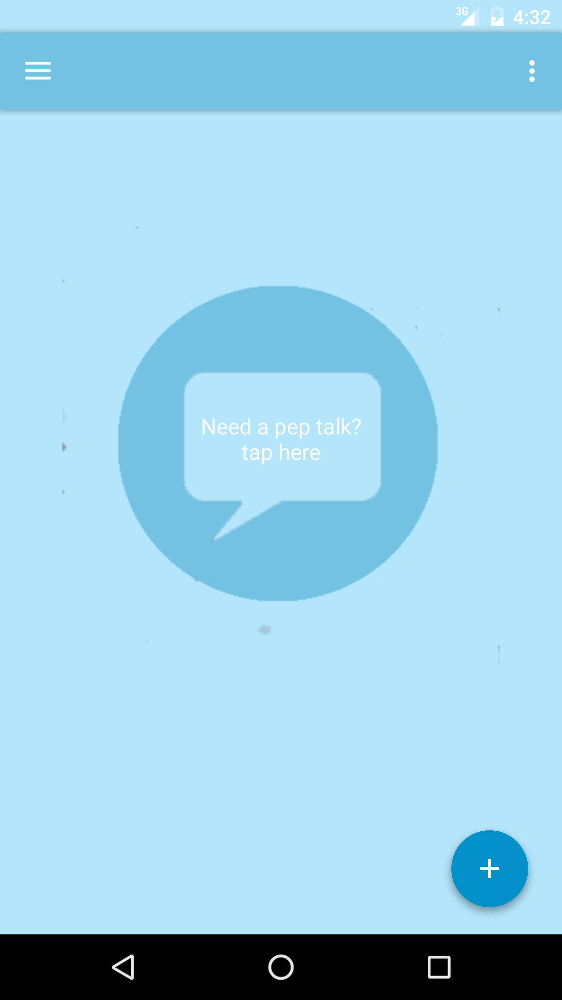
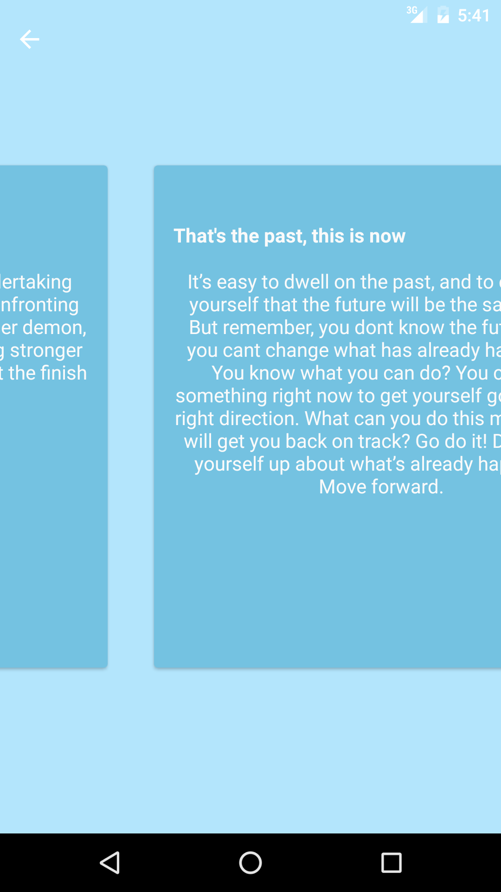
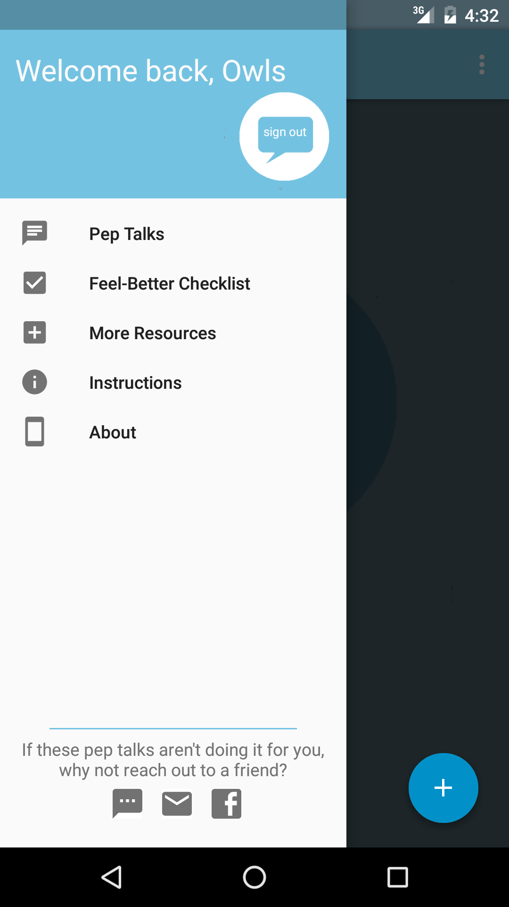
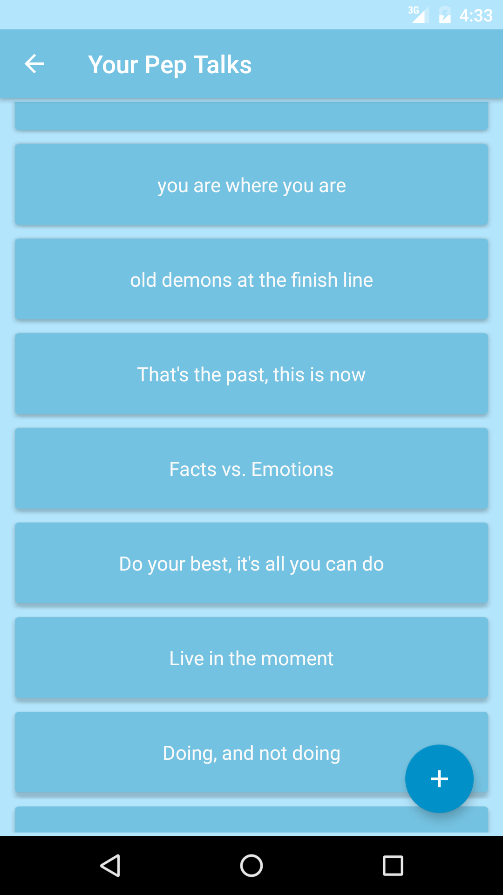

# PepTalkPal

[Link to Google Play Store] (https://play.google.com/store/apps/details?id=owlslubic.peptalkapp)

_Pep Talk Pal helps manage your chaotic life, because taking care of yourself is important! When you're overwhelmed at work and need to hide in the bathroom, when the mere thought of checking your email makes you sweat, or when you're laying awake at night going over all the things you did or didn't do... this app will remind you, in your own words, that you're going to be okay. 
Wherever you are, Pep Talk Pal is here for you._

####_Features include:_
- Create a profile and back up data with Firebase's Realtime Database. 
- Pre-loaded Pep Talks and Checklist suggestions (which can be edited) to serve as templates for the user to write his/her own (because no one knows the user better than he/she does!)
- View Pep Talks directly from main activity, or go to the Pep Talk List to access a specific one.
- Check off items in the Feel-Better Checklist, and the user can add his/her own along with notes.
- Emergency Pep Talk home screen widget -- the user can write a little message to him/herself and then view it on the home screen widget. Tap the widget to see the emergency pep talk, and tap again to hide it. For the user's eyes only!
- Write down a Pep Talk as soon as it comes to mind using the Add New Pep Talk home screen widget _(currently disabled)_
- At the bottom of the navigation drawer, the user is encouraged to reach out to friends with icons that open their default email/sms apps 

   
  
   
  

